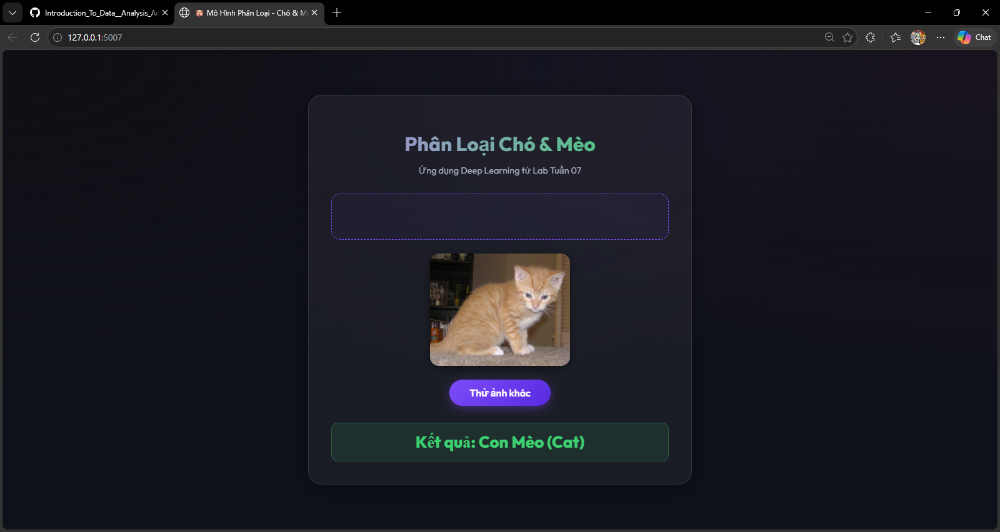
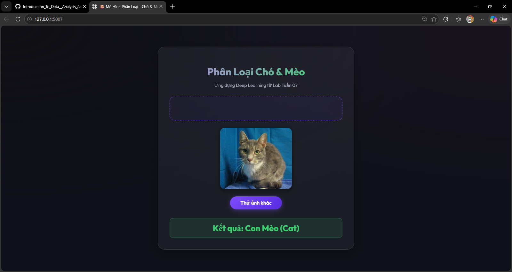
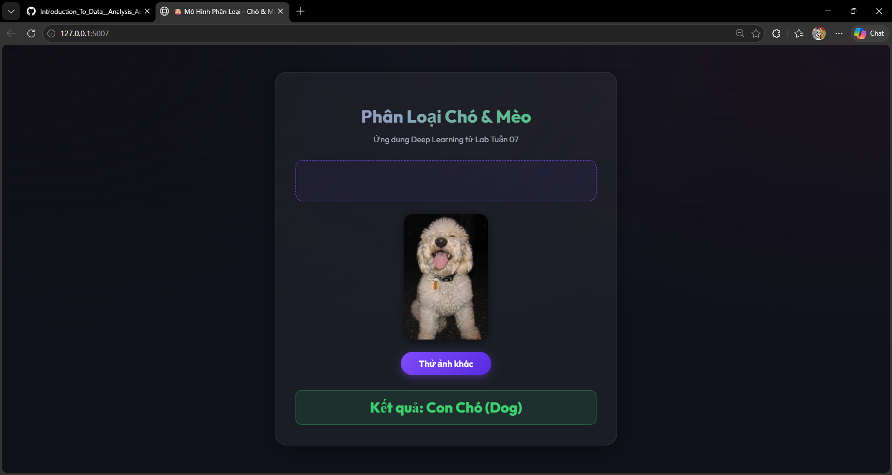
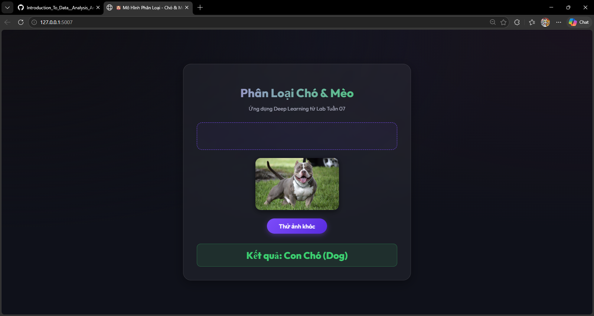

# DEEP LEARNING

- **Sinh viên thực hiện:** Phạm Thế Hùng  
- **MSSV:** 2374802010164  
- **Môn học:** Giới Thiệu Học Sâu  
- **Giảng viên:** Nguyễn Thái Anh

## Phân Loại Chó & Mèo bằng CNN

### Công nghệ sử dụng
- **Python 3**
- **PyTorch**  xây dựng và huấn luyện CNN
- **Torchvision**  tải và tiền xử lý dữ liệu ảnh
- **NumPy**  tính toán độ chính xác
- **Matplotlib** — vẽ biểu đồ Loss và Accuracy

- **Link dataset**: https://www.kaggle.com/datasets/bhavikjikadara/dog-and-cat-classification-dataset

### Cách hoạt động

- **Tiền xử lý**: resize ảnh về `128×128`,lật ngang, xoay ±10°, chuẩn hóa, batch size `128`
- **Kiến trúc CNN**: 4 khối `Conv2D → BatchNorm → ReLU → MaxPool`, sau đó `Flatten → Linear(512) → Dropout(0.5) → Linear(2)`
- **Huấn luyện**: Adam optimizer (`lr=1e-3`, `weight_decay=5e-4`), CrossEntropyLoss, 50 epochs

### Kết quả
> **Độ chính xác cuối cùng trên tập test: 90.11%**

## Giao Diện Web Ứng Dụng (Flask WebApp)
Ứng dụng web được xây dựng giúp người dùng dễ dàng trải nghiệm và kiểm tra mô hình AI đã huấn luyện mà không cần viết code.

### Điểm nổi bật:
- **Sử dụng trực quan**: Chỉ cần truy cập `http://localhost:5007`, tải ảnh lên (hoặc kéo thả) là hệ thống sẽ tự động dự đoán đây là Chó hay Mèo.
- **Chống lỗi sập trang (Anti-Crash)**: Ngay cả khi bạn chưa có file mô hình (`cat_and_dog_model.pth`), web vẫn sẽ hoạt động bình thường ở chế độ giả định thay vì báo lỗi.
- **Tự động xử lý**: Mọi thao tác xử lý ảnh khó nhằn đều được hệ thống tự động làm ngầm trước khi đưa vào mô hình AI.
- **Thiết kế**: Giao diện mang đậm phong cách Dark-mode cực kỳ bắt mắt, thân thiện với người dùng.

## Demo Giao Diện Phân Loại Chó Mèo

